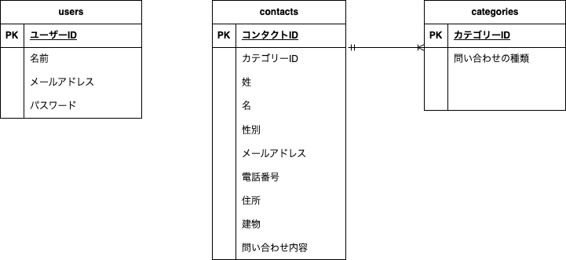

# お問い合わせフォーム

## 環境構築

Docker ビルド

1. docker-compose up -d --build

Laravel 環境構築

1. docker-compose exec php bash
1. cp .env.example .env
1. composer install
1. php artisan key:generate
1. php artisan migrate
1. php artisan db:seed

## 使用技術（実行環境）

- PHP 8.0
- Laravel 10.0
- MySQL 8.0

## ER 図

## URL

- 開発環境: [http://localhost](http://localhost)
- phpMyAdmin: [http://localhost:8080](http://localhost:8080)
